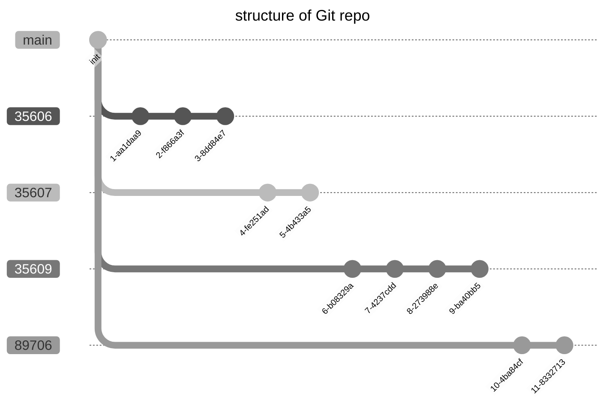

Script to aggregate multiple different git repositories into one.
Specificly this script search for every repo on the repositories and transform this kind structure:
```
    ├── 5721
    │   ├── 35606 -repo
    │   │   └── doc
    │   ├── 35607 -repo
    │   │   └── doc
    │   └── 35609 -repo
    │       └── doc
    └── 8976
        └── 42512 -repo
```


into a repo named `page` of this nature:


